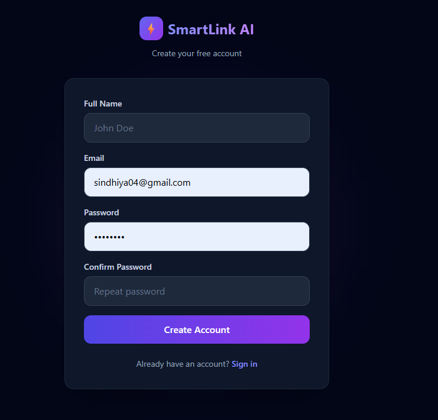
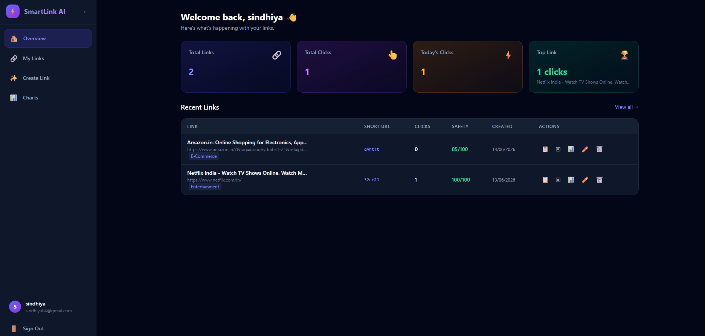
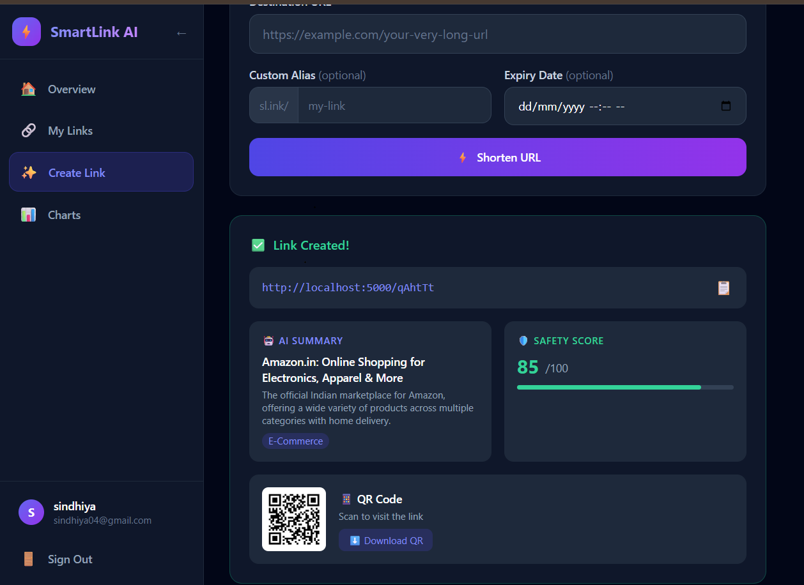
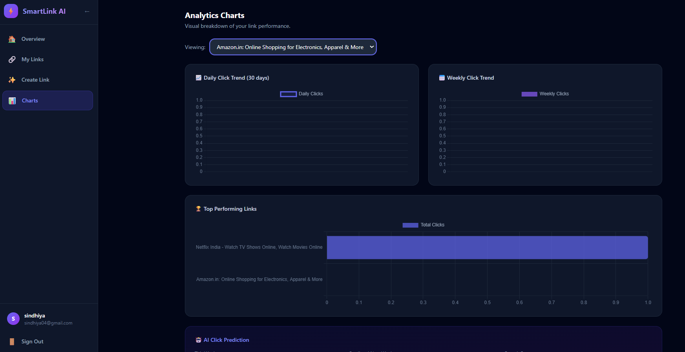
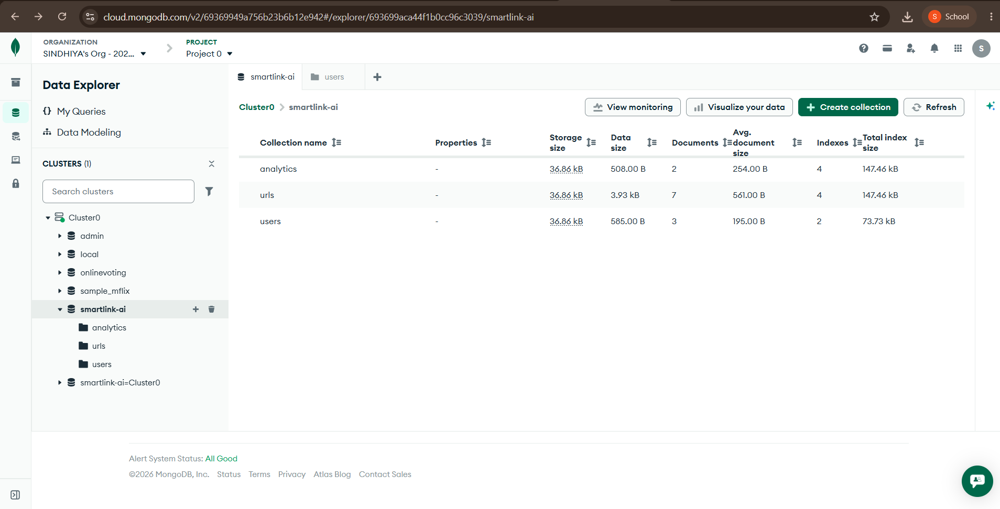
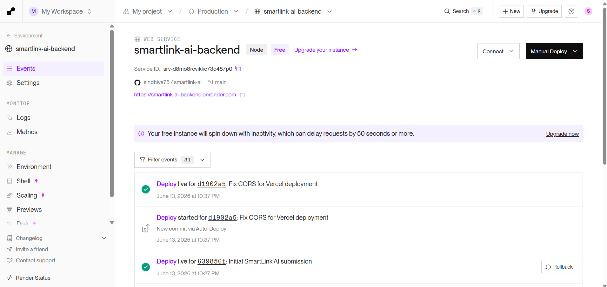
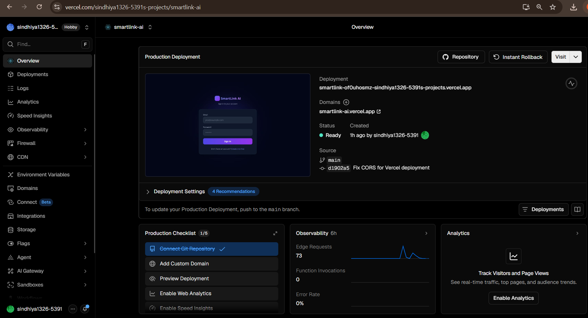

# ⚡ SmartLink AI — Intelligent URL Shortener with Analytics

> AI-powered URL shortener with real-time analytics, safety scoring, QR codes, and click prediction. Built for the hackathon with a production-grade full-stack architecture.

---

## 📋 Table of Contents

1. [Project Overview](#-project-overview)
2. [Features](#-features)
3. [Tech Stack](#-tech-stack)
4. [Architecture](#-architecture)
5. [Project Structure](#-project-structure)
6. [Installation & Setup](#-installation--setup)
7. [Environment Variables](#-environment-variables)
8. [API Documentation](#-api-documentation)
9. [Screenshots](#-screenshots)
10. [Demo Video](#-demo-video)
11. [Deployment Guide](#-deployment-guide)
12. [Assumptions](#-assumptions)
13. [License](#-license)

---

## 🚀 Project Overview

**SmartLink AI** is a modern, full-stack URL shortener platform that goes beyond simple link shortening. Powered by Google Gemini AI, it automatically generates page summaries, categorizes links, and predicts future traffic — while giving users a beautiful, data-rich analytics dashboard.

Key differentiators:
- 🤖 **AI summaries** — Gemini generates a title, summary, and category for each shortened link
- 🛡️ **Safety scoring** — every URL is scored 0–100 based on HTTPS, suspicious keywords, and domain patterns
- 📊 **Rich analytics** — device, browser, OS, and country breakdowns with Chart.js visualizations
- 🔮 **Click prediction** — linear regression model predicts next-week clicks
- 📱 **QR code generator** — downloadable QR codes for every short link
- 🔗 **Public stats pages** — shareable analytics at `/stats/:shortCode`
- ⏰ **Link expiry** — set custom expiry dates with branded expired pages

---

## ✨ Features

### Authentication
- [x] User registration & login with bcrypt-hashed passwords
- [x] JWT-based stateless authentication
- [x] Protected routes (frontend + backend)
- [x] Auto-logout on token expiry

### URL Shortening
- [x] Shorten any valid URL
- [x] Custom alias support
- [x] Auto-generated unique short codes (6-char alphanumeric)
- [x] Edit destination URL
- [x] Delete URL + associated analytics
- [x] One-click copy to clipboard

### User Dashboard
- [x] Stats cards: total links, total clicks, today's clicks, top link
- [x] Full URL table with sort and per-row actions (copy, analytics, edit, delete)
- [x] Tab-based navigation: Overview → My Links → Create → Charts

### Analytics
- [x] Per-click tracking: browser, device, OS, country, referrer
- [x] Daily click trends (30 days)
- [x] Weekly click trends (8 weeks)
- [x] Top performing URLs chart
- [x] AI click prediction (this week vs predicted next week)
- [x] Recent visit history table
- [x] Public shareable stats page

### AI & Bonus Features
- [x] AI URL Summary (Gemini Pro)
- [x] URL Safety Score (0–100)
- [x] QR Code Generator (downloadable PNG)
- [x] Link Expiry with custom expired page
- [x] AI Click Prediction (linear regression)
- [x] Public Stats Page (`/stats/:shortCode`)

### UI/UX
- [x] Dark mode (default)
- [x] Responsive mobile-first design
- [x] Sidebar navigation (collapsible)
- [x] Toast notifications
- [x] Loading skeletons
- [x] Empty states
- [x] Smooth animations (fade-in, slide-up)

---

## 🛠 Tech Stack

| Layer      | Technology                     |
|------------|-------------------------------|
| Frontend   | React 18, React Router v6, Tailwind CSS, Chart.js, Axios |
| Backend    | Node.js, Express.js            |
| Database   | MongoDB Atlas + Mongoose       |
| Auth       | JWT + bcryptjs                 |
| AI         | Google Gemini Pro API          |
| QR Code    | qrcode npm package             |
| Device Detection | ua-parser-js             |
| Geo IP     | ipapi.co (free tier)           |

---

## 🏗 Architecture

```
┌─────────────────────────────────────────────────────────┐
│                    CLIENT (React)                        │
│  ┌──────────┐  ┌──────────┐  ┌──────────┐              │
│  │  Auth    │  │ Dashboard│  │Analytics │              │
│  │  Pages   │  │  Pages   │  │  Pages   │              │
│  └────┬─────┘  └────┬─────┘  └────┬─────┘              │
│       └─────────────┴─────────────┘                     │
│                      │ Axios HTTP                        │
└──────────────────────┼──────────────────────────────────┘
                        │
┌──────────────────────┼──────────────────────────────────┐
│              Express.js API Server                       │
│  ┌─────────────────────────────────────────────────┐    │
│  │              Middleware Layer                    │    │
│  │  JWT Auth Guard │ Rate Limiter │ CORS │ Parser   │    │
│  └──────────────────────────────────────────────────    │
│  ┌──────────┐  ┌──────────┐  ┌──────────────────┐      │
│  │  Auth    │  │   URL    │  │   Analytics      │      │
│  │Controller│  │Controller│  │   Controller     │      │
│  └────┬─────┘  └────┬─────┘  └────────┬─────────┘      │
│       │              │                  │                │
│  ┌────┴─────────────┴──────────────────┴─────────┐      │
│  │              Service Layer                     │      │
│  │   aiService (Gemini)  │  safetyService        │      │
│  └────────────────────────────────────────────────      │
└──────────────────────┼──────────────────────────────────┘
                        │ Mongoose ODM
┌──────────────────────┼──────────────────────────────────┐
│                MongoDB Atlas                             │
│   Users Collection │ URLs Collection │ Analytics        │
└─────────────────────────────────────────────────────────┘
                        │ External API
                   Google Gemini AI
```

---

## 📁 Project Structure

```
smartlink-ai/
├── backend/
│   ├── config/
│   │   └── database.js          # MongoDB connection
│   ├── controllers/
│   │   ├── authController.js    # Register, login, profile
│   │   ├── urlController.js     # CRUD + dashboard stats
│   │   ├── analyticsController.js # Analytics + top URLs
│   │   └── redirectController.js  # Short URL redirect + tracking
│   ├── middleware/
│   │   └── authMiddleware.js    # JWT guard
│   ├── models/
│   │   ├── User.js              # User schema
│   │   ├── Url.js               # URL schema with AI fields
│   │   └── Analytics.js         # Analytics schema
│   ├── routes/
│   │   ├── authRoutes.js
│   │   ├── urlRoutes.js
│   │   ├── analyticsRoutes.js
│   │   └── redirectRoutes.js
│   ├── services/
│   │   └── aiService.js         # Gemini AI + safety scorer
│   ├── .env.example
│   ├── package.json
│   └── server.js
│
└── frontend/
    ├── public/
    ├── src/
    │   ├── components/
    │   │   ├── dashboard/
    │   │   │   ├── CreateUrlForm.js
    │   │   │   ├── UrlTable.js
    │   │   │   ├── StatsCards.js
    │   │   │   └── Charts.js
    │   │   └── ui/
    │   │       └── Sidebar.js
    │   ├── context/
    │   │   ├── AuthContext.js   # Auth state
    │   │   └── ToastContext.js  # Global toasts
    │   ├── pages/
    │   │   ├── LoginPage.js
    │   │   ├── RegisterPage.js
    │   │   ├── DashboardPage.js
    │   │   ├── AnalyticsPage.js
    │   │   ├── PublicStatsPage.js
    │   │   ├── NotFoundPage.js
    │   │   └── ExpiredPage.js
    │   ├── services/
    │   │   └── api.js           # Axios instance
    │   ├── App.js
    │   └── index.js
    ├── .env.example
    ├── package.json
    └── tailwind.config.js
```

---

## ⚙️ Installation & Setup

### Prerequisites
- Node.js >= 18.x
- npm >= 9.x
- MongoDB Atlas account (free tier works)
- Google Gemini API key (optional — AI features degrade gracefully without it)

### 1. Clone the repository
```bash
git clone https://github.com/yourusername/smartlink-ai.git
cd smartlink-ai
```

### 2. Backend Setup
```bash
cd backend
npm install

# Copy and configure environment
cp .env.example .env
# Edit .env with your values (see Environment Variables section)

# Start development server
npm run dev
```

### 3. Frontend Setup
```bash
cd frontend
npm install

# Copy and configure environment
cp .env.example .env
# Set REACT_APP_API_URL=http://localhost:5000

# Start development server
npm start
```

The app will be available at:
- Frontend: http://localhost:3000
- Backend API: http://localhost:5000
- API Health: http://localhost:5000/api/health

---

## 🔑 Environment Variables

### Backend (`backend/.env`)

| Variable | Required | Description |
|---|---|---|
| `PORT` | No | Server port (default: 5000) |
| `NODE_ENV` | No | `development` or `production` |
| `MONGODB_URI` | **Yes** | MongoDB Atlas connection string |
| `JWT_SECRET` | **Yes** | Long random string for JWT signing |
| `JWT_EXPIRE` | No | Token expiry (default: `7d`) |
| `BASE_URL` | **Yes** | Backend base URL (for short link generation) |
| `CLIENT_URL` | **Yes** | Frontend URL (for CORS + redirects) |
| `GEMINI_API_KEY` | No | Google Gemini API key (AI features) |

### Frontend (`frontend/.env`)

| Variable | Required | Description |
|---|---|---|
| `REACT_APP_API_URL` | **Yes** | Backend API base URL |

---

## 📡 API Documentation

### Authentication

| Method | Endpoint | Body | Auth | Description |
|---|---|---|---|---|
| POST | `/api/auth/register` | `{name, email, password}` | ❌ | Create account |
| POST | `/api/auth/login` | `{email, password}` | ❌ | Login |
| GET | `/api/auth/me` | — | ✅ | Get current user |

### URL Management

| Method | Endpoint | Body | Auth | Description |
|---|---|---|---|---|
| POST | `/api/url/create` | `{originalUrl, customAlias?, expiryDate?}` | ✅ | Create short URL |
| GET | `/api/url/all` | — | ✅ | Get all user URLs |
| GET | `/api/url/stats/summary` | — | ✅ | Dashboard stats |
| GET | `/api/url/:id` | — | ✅ | Get URL by ID |
| PUT | `/api/url/:id` | `{originalUrl?, expiryDate?}` | ✅ | Update URL |
| DELETE | `/api/url/:id` | — | ✅ | Delete URL |

### Analytics

| Method | Endpoint | Auth | Description |
|---|---|---|---|
| GET | `/api/analytics/:shortCode` | ✅ | Full analytics (owner only) |
| GET | `/api/analytics/public/:shortCode` | ❌ | Public stats |
| GET | `/api/analytics/top-urls` | ✅ | Top URLs for charts |

### Redirect

| Method | Endpoint | Auth | Description |
|---|---|---|---|
| GET | `/:shortCode` | ❌ | Redirect to original URL |

---

## 🚀 Deployment Guide

### Backend → Render

1. Push code to GitHub
2. Go to [render.com](https://render.com) → New Web Service
3. Connect your repo → select `backend/` as root directory
4. Set **Build Command**: `npm install`
5. Set **Start Command**: `node server.js`
6. Add all environment variables from `backend/.env`
7. Set `NODE_ENV=production`, `BASE_URL=https://your-render-url.onrender.com`

### Frontend → Vercel

1. Go to [vercel.com](https://vercel.com) → New Project
2. Import your GitHub repo → set **Root Directory** to `frontend/`
3. Framework: Create React App (auto-detected)
4. Add environment variable: `REACT_APP_API_URL=https://your-render-url.onrender.com`
5. Deploy!

### Database → MongoDB Atlas

1. Create cluster at [mongodb.com/atlas](https://www.mongodb.com/atlas)
2. Create a database user with read/write access
3. Whitelist `0.0.0.0/0` for Render IP access
4. Copy connection string → paste in `MONGODB_URI`

---

## 📸 Screenshots

## Login Page


## Dashboard


## AI Summary


## Analytics


## MongoDB Atlas


## Render Deployment


## Vercel Deployment


---

## 🎥 Demo Video

> *Add your Loom / YouTube demo link here.*

---

## 📝 Assumptions

1. **Geo IP**: Uses `ipapi.co` free API (150 req/day). For production, swap for MaxMind GeoLite2 or ipinfo.io with a paid key.
2. **AI Summaries**: Gemini Pro API is optional. All URL creation works without it — the AI fields simply show fallback values.
3. **Click Prediction**: Uses a simple week-over-week linear regression. Sufficient for a hackathon; replace with a proper ML model for production.
4. **Short Code Uniqueness**: 6-char alphanumeric = 56 billion combinations. Collision retries handle rare cases.
5. **QR Codes**: Generated server-side as base64 data URLs. Large-scale production should store them in S3/Cloudinary.
6. **Rate Limiting**: Set to 100 requests per 15 minutes per IP. Adjust in `server.js` for production.
7. **Password Policy**: Minimum 6 characters enforced. Upgrade for production (require uppercase, symbols, etc.).

---

## 🤝 Contributing

Pull requests are welcome. For major changes, please open an issue first.

---

## 📄 License

MIT © SmartLink AI

---

*This project is a part of a hackathon run by https://katomaran.com*
